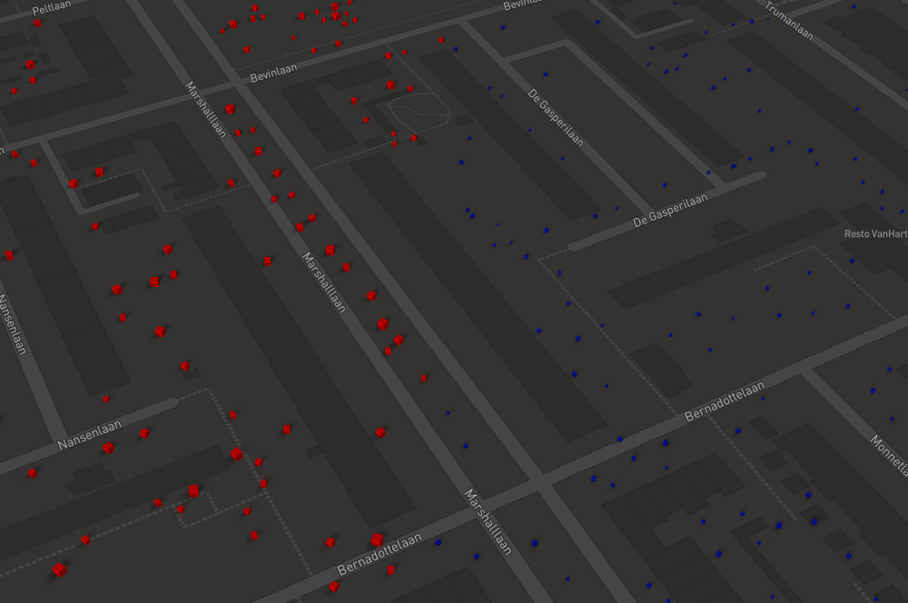
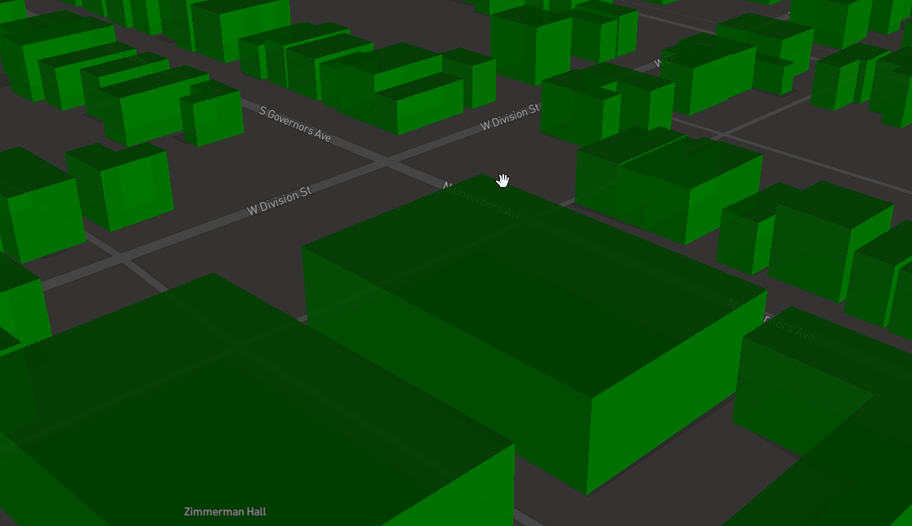
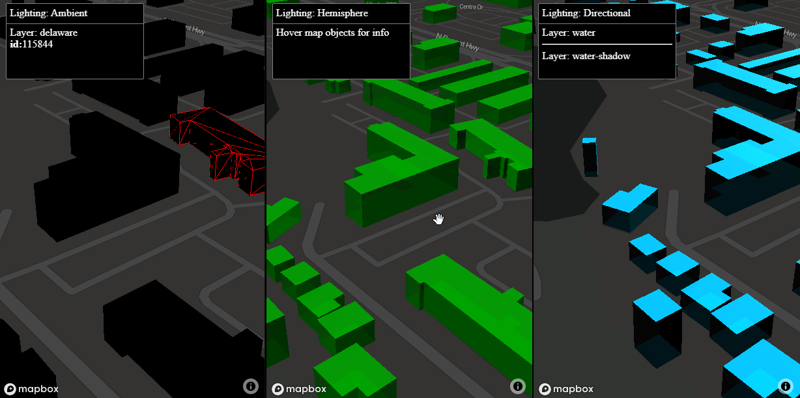
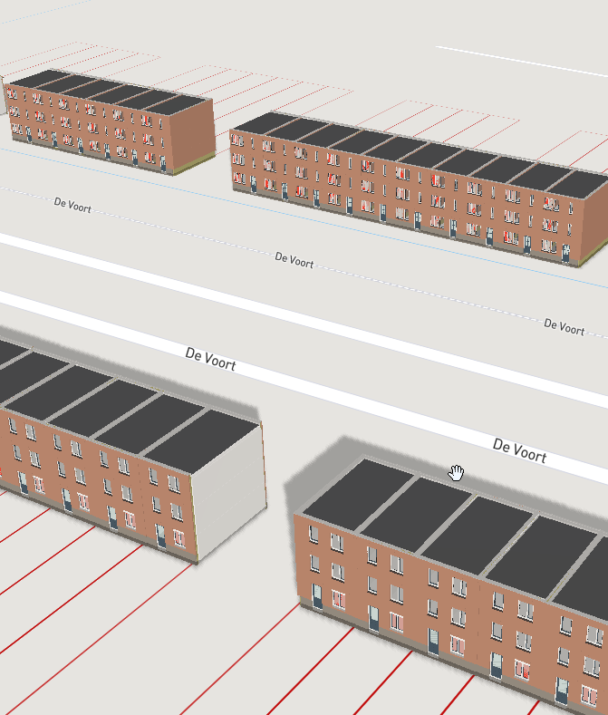
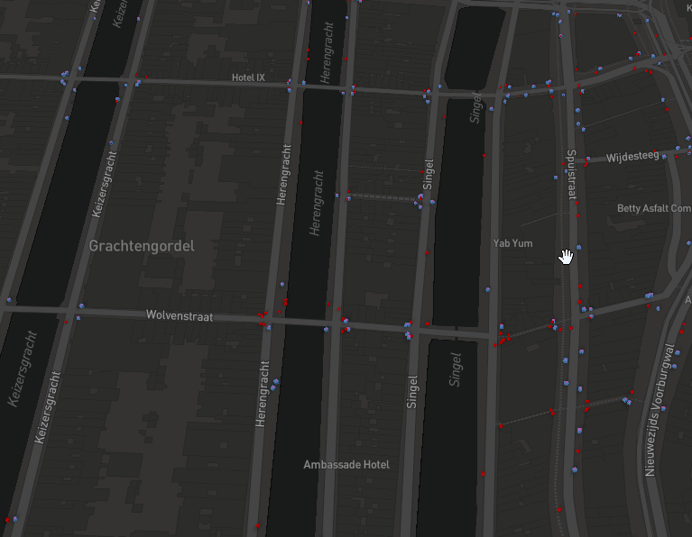
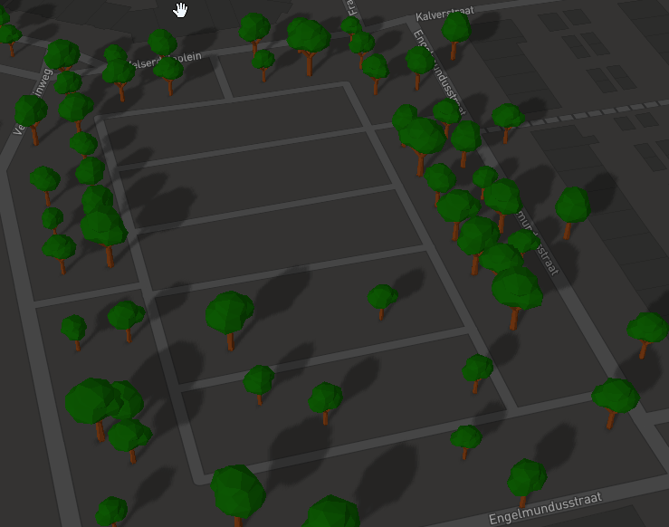

# mapbox_3dtiles_samples

## Demo's  MapBox GL JS v3

In MapBox GL JS v3 beta functionality 3D model support is added to the standard library.

Some demo's with it:

1] Load glTF model

https://bertt.github.io/mapbox_3dtiles_samples/samples/standard/3dmodel/

2] 170K trees

https://bertt.github.io/mapbox_3dtiles_samples/samples/standard/trees/

3] Batched models

https://bertt.github.io/mapbox_3dtiles_samples/samples/standard/b3dm_working/

4] Custom GLB at Dam square

https://bertt.github.io/mapbox_3dtiles_samples/samples/standard/dam_square/

5] Delaware buildings

https://bertt.github.io/mapbox_3dtiles_samples/samples/standard/delaware/

6] Tienhoven Dutch 3D bag

https://bertt.github.io/mapbox_3dtiles_samples/samples/standard/tienhoven/

7] Tiles on multiple levels 15,16,17

https://bertt.github.io/mapbox_3dtiles_samples/samples/standard/multiple_levels

## Classic Demo's using Mapbox3DTiles.js

Repository with some samples of 3D Tiles in a MapBox viewer.

In these demo https://github.com/Geodan/mapbox-3dtiles is used for handling the 3D tiles.

1] LOD's demo

Demo MapBox GL JS + 3D Tiles Level of detail. Different glTF models are visualized for far/nearby.

https://bertt.github.io/mapbox_3dtiles_samples/samples/lods

2] Demo MapBox GL JS + referencing external tilesets 

https://bertt.github.io/mapbox_3dtiles_samples/samples/external

Two tilesets are displayed in 1 layer using 'external tileset' technique.

3] Demo MapBox GL JS + 3D tiles with glTF SpecularGlossiness shader

https://bertt.github.io/mapbox_3dtiles_samples/samples/shaders

4] Demo MapBox GL JS + client side lighting examples (ambient, hemisphere, directional)

https://bertt.github.io/mapbox_3dtiles_samples/samples/lighting

5] Demo MapBox GL JS + placement b3dm's (house models converted from IFC)

https://bertt.github.io/mapbox_3dtiles_samples/samples/b3dm

6] Demo MapBox GL JS + composite tiles (cmpt)

https://bertt.github.io/mapbox_3dtiles_samples/samples/composite

Composite tiles contains two instanced models.

7] Demo MapBox GL JS + instanced 3D Tiles (i3dm)

https://bertt.github.io/mapbox_3dtiles_samples/samples/instanced

Instanced models with random scale/rotation and batch info

------------------------------------------------------------------------

Not working demo's:

- Demo MapBox GL JS + 3D tiles with glTF animations

Note: Visualizing glTF animations is not working yet :-(

https://bertt.github.io/mapbox_3dtiles_samples/samples/animations

- Demo MapBox GL JS + Draco compressed 3D Tiles 

Note: Visualizing 3D Tiles with Draco compression is not working yet :-(

https://bertt.github.io/mapbox_3dtiles_samples/samples/draco.html

